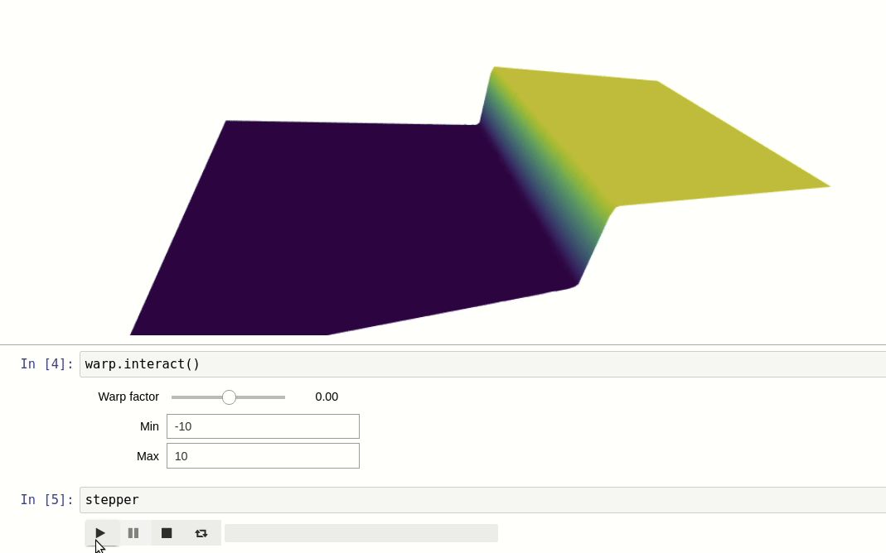

<h1 align="center">Odysis</h1>
<h2 align="center"> Jupyter interactive widgets library for 3-D mesh analysis
<h2 align="center"><a href="https://github.com/martinRenou/Odysis_examples">Notebook Examples</a></h1>

Features
--------

Odysis has many features including:

- **VTK loader** for displaying your computation results in the Jupyter Notebook
- **Structured and Unstructured grids** support
- 2-D cell based meshes support (quads, triangles...) as well as 3-D cell based meshes support (tetrahedrons, quadratic tetrahedrons...)
- **Animations**
- **Color mapping**, with color maps like "viridis", "magma", "inferno"...
- **Warp** effect
- **IsoSurface** computation
- **Threshold** effect (for visualizing only the parts that are inside of a range of data)
- **Clip** effect
- **Slice** computation
- **Vector fields** visualization

Most of those features (color mapping, warp effect, threshold, clipping...) are **very fast**, because they are done on the GPU. Features that are not done on the GPU like IsoSurface or Slice are done using Octrees or binary tree algorithms.

Installation
------------

**Odysis is an early developer preview. Features and implementation are subject to change.**

With conda: (coming soon)

    $ conda install -c conda-forge odysis

With pip: (coming soon)

    $ pip install odysis
    $ jupyter nbextension enable --py --sys-prefix odysis

For a development installation (requires npm),

    $ git clone https://github.com/martinRenou/Odysis.git
    $ cd Odysis
    $ pip install -e .
    $ jupyter nbextension install --py --symlink --sys-prefix odysis
    $ jupyter nbextension enable --py --sys-prefix odysis

Acknowledgment
--------------

This work is based on SciviJS, a JavaScript library for fast 3-D mesh analysis, see https://demo.logilab.fr/SciviJS/
